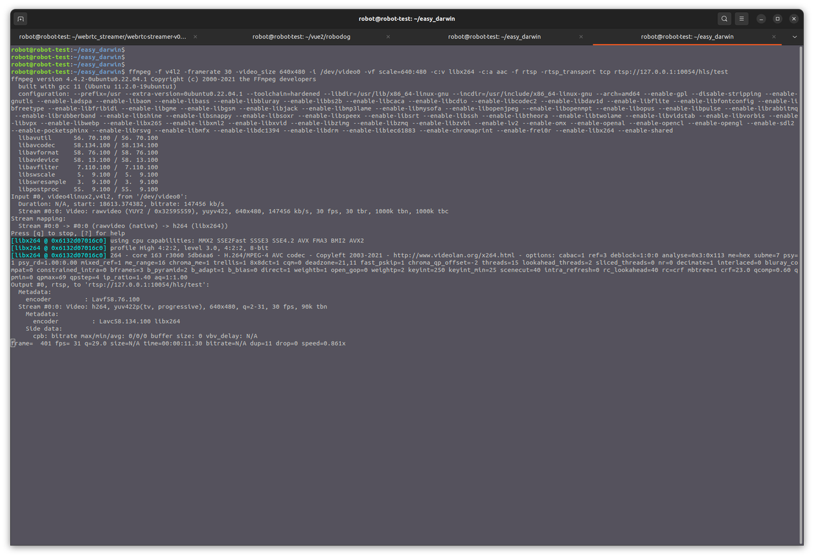
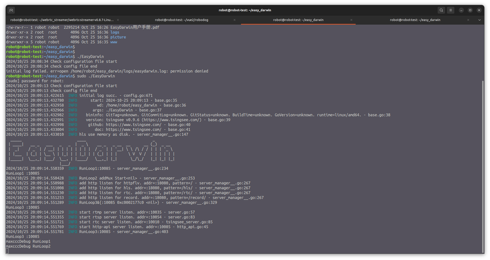

# Video streaming with Computer Webcam

##  1. Objectives

The objective of this article is an experiment, rather than a final product. In the experiment, we setup the communication channel from a computer's webcam to a website, to practice the related techniques. 

More specifically, the system consists of the following components, 

1. Running [ffmpeg](https://www.ffmpeg.org/) in a ubuntu CLI terminal, to push the video stream captured by the ubuntu computer's camera, to the server via RTSP protocol.

2. On the server side, an [EasyDarwin engine](https://www.easydarwin.org/p/easydarwin.html) collects the video stream from multiple robots via RTSP.
  
3. A [VLC media player](https://www.videolan.org/vlc/) pulls the video stream from the EasyDarwin engine, via RTSP protocol. 

4. A [WebRTC_streamer engine](https://github.com/mpromonet/webrtc-streamer) pulls the video stream from the EasyDarwin engine, the WebRTC_streamer also runs on the server side.

5. The WebRTC_streamer pushes the video stream to website, developed with VUE, via WebRTC protocol.

All the 5 components, ffmpeg, EasyDarwin, WebRTC-Streamer, VLC, and VUE website, run on one ubuntu computer for testing purpose.

&nbsp;
## 2. ffmpeg pushes video stream from webcam to EasyDarwin

### 2.1 Install ffmpeg
   
~~~
$ sudo add-apt-repository -y ppa:djcj/hybrid && sudo apt update && sudo apt install -y ffmpeg
~~~

### 2.2 Push video stream from webcam via RTSP

~~~
$ ffmpeg -f v4l2 -framerate 30 -video_size 640x480 -i /dev/video0 -vf scale=640:480 -c:v libx264 -c:a aac -f rtsp -rtsp_transport tcp rtsp://127.0.0.1:10054/hls/test
~~~

Notice, 

1. In ubuntu, the format of the webcam is `v4l2`.

2. `rtsp://127.0.0.1:10054` is the protocol and address of EasyDarwin engine, we will talk about it in more details later in this article.

The following screen snapshot shows the running result in a ubuntu CLI terminal,

&nbsp;
## 3. EasyDarwin collects video streams

Referring to [EasyDarwin's github repo](https://github.com/EasyDarwin/EasyDarwin), for installation and running. 

The following screen snapshot shows the running result in a ubuntu CLI terminal. 

Notice, the EasyDarwin engine listens to the RTSP at port 10054. 

&nbsp;
## 4. A VLC media player pulls the video stream from the EasyDarwin

Open VLC media player, and navigate to the setting of `open network`, type in 

~~~
rtsp://127.0.0.1:10054/hls/test
~~~

Notice, the protocol and address must be consistent with EasyDarwin, as well as ffmpeg's setting. 

So far, we have setup a communication channel, 

1. `ffmpeg` pushes the webcam video stream to an `EasyDarwin engine`.

2. A `VLC media player` pulls the video stream from the `EasyDarwin engine`.

The webcam video stream is displayed in the VLC player, shown in the following video clip. 

   
